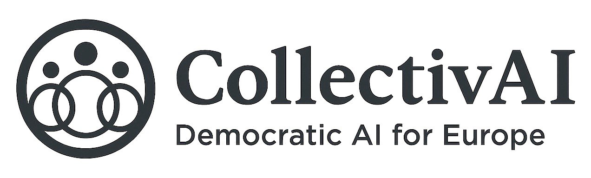

<p align="center">
  
</p>

<h1 align="center">CollectivAI</h1>
<h3 align="center">Democratic • Ethical • Human-Centered AI for Europe</h3>

<p align="center">
CollectivAI is a sovereign, transparent, and democratic AI ecosystem designed for the European public.<br>
Its mission is to create AI that strengthens society, protects democracy, improves life, and serves humanity — never the opposite.
</p>

---

## 🚀 Mission

To build Europe's first **public, democratic and ethical AI infrastructure** —  
owned by its citizens, aligned with European values, and designed to:

- protect democracy  
- support the economy  
- stabilize geopolitics  
- accelerate science and research  
- safeguard the climate  
- improve quality of life  
- preserve human dignity  

**AI must uplift people. Not replace them. Not harm them. Not control them.**

---

## 🌍 Human-Centered Ethical AI

CollectivAI is built on the principle that AI must:

### ✔ help humanity  
### ✔ protect society  
### ✔ enhance wellbeing  
### ✔ promote peace  
### ✔ strengthen democracy  
### ✔ preserve life & dignity  

It supports:

- climate protection  
- economic stability  
- medical research  
- crisis prevention  
- social wellbeing  
- citizen empowerment  

This is AI for the future — **AI for good**.

---

## 📘 Whitepaper

📄 **Full Markdown Version:**  
👉 [WHITEPAPER.md](WHITEPAPER.md)

---

## 🧩 Repository Structure

```text
collectivai/
├── README.md                # Projektübersicht
├── WHITEPAPER.md            # Whitepaper als Markdown
├── LICENSE                  # Lizenz (z.B. MIT)
│
├── docs/
│   ├── CollectivAI_Whitepaper_Full.pdf
│   └── logo.png
│
├── architecture/
│   ├── system-architecture.md
│   ├── node-network.md
│   ├── security-model.md
│   └── diagrams/
│       ├── architecture.svg
│       ├── governance.svg
│       └── nodes.svg
│
├── governance/
│   ├── governance-model.md
│   ├── voting-process.md
│   ├── roles.md
│   └── constitution.md
│
├── roadmap/
│   ├── roadmap-2025-2030.md
│   ├── milestones.md
│   └── releases.md
│
├── branding/
│   ├── logo.png
│   ├── typography.md
│   ├── colors.md
│   └── press-kit/
│       └── CollectivAI-PressPack.zip
│
└── contributing/
    ├── CONTRIBUTING.md
    ├── CODE_OF_CONDUCT.md
    └── issue_templates/
        ├── bug_report.md
        └── feature_request.md
